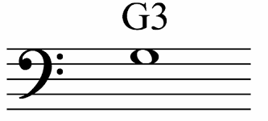

# guitarScroller

## My auto scroller of personal and hard to find pieces.

A habit I have tried to instill in myself, is whenever I try to "get back on the horse" with something like guitar playing, is to ask what caused me to put it down last time.  Sometimes there's no reason that can be found in my guitar process and it could be put down as "life intervening".  More often then not however there is a reason behind my ennui.

My last guitar push was multi-faceted, with classes at my park district (cancelled due to covid), a powerful app with a few drawbacks, and a popular online guitar-tab auto scroller.

This time, I'm going to drive the training process with js, and want some extra things.

Starting with guitarScroller.  I'd like to couple a scroller with a dial to increase/decrease speed.  And an editor, to write pieces I won't find in the poular library sites.  This will also help if I want to transpose.

I'll work on tone detection in future application development, but let's keep the effort bite size.

To meet goal on this project, I want...

### Features

- The ability to add music
- That music to scroll at adjustable speed
- A musical sign converter G3 = 1/3 = 

Let's see what I can do!

In the future,  I'd like to build tools that help me with...
- Guitar geography (knowing where the c string is )
- Know what I am getting wrong (what note am I playing instead of the correct one? what is the interval between correct and erroneous notes?)
- If it is sensing my chord is not correct, what chord does the sensor think I'm playing?
- things like that